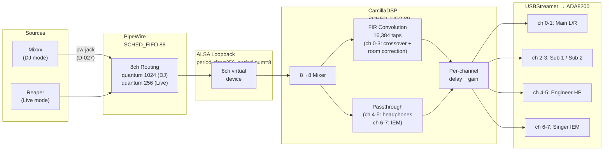

# Real-Time Audio Stack Configuration

This document describes the full real-time (RT) configuration of the Pi 4B
audio workstation. It covers the PREEMPT_RT kernel, thread scheduling
priorities, PipeWire and CamillaDSP RT configuration, buffer sizing, and
verification procedures.

All configuration files referenced here are version-controlled under
`configs/` in this repository. The ground truth hierarchy for the Pi's
state is: CLAUDE.md > Pi itself > `configs/` directory > `docs/project/`.

**Safety:** All operational safety constraints (transient risk, driver
protection, measurement safety, gain staging) are in
[`docs/operations/safety.md`](../operations/safety.md). This document covers
architecture and configuration only.

---

## Executive Summary

The RT audio stack delivers deterministic, low-latency audio processing on a
Raspberry Pi 4B driving a PA system through 4x450W amplifiers. The design
prioritizes scheduling determinism as a safety requirement (D-013).

### Key Performance Numbers

| Metric | DJ/PA Mode | Live Mode | Evidence |
|--------|-----------|-----------|----------|
| CamillaDSP CPU (16k taps, 4ch FIR) | 5.23% at chunksize 2048 | 19.25% at chunksize 256 | [US-001](../lab-notes/US-001-camilladsp-benchmarks.md) T1a, T1c |
| CamillaDSP latency (2 chunks) | 85.3ms | 10.7ms | [US-002](../lab-notes/US-002-latency-measurement.md) T2a, T2b |
| Estimated PA path (one-way) | ~120ms | ~22ms (projected) | [US-002](../lab-notes/US-002-latency-measurement.md) analysis |
| PipeWire quantum | 1024 (21.3ms) | 256 (5.3ms) | D-011 |
| Mixxx CPU (hardware V3D GL) | ~85% | N/A | [F-012/F-017](../lab-notes/F-012-F-017-rt-gpu-lockups.md) Test 5 |
| Mixxx CPU (llvmpipe, obsolete) | 142-166% | N/A | [F-012/F-017](../lab-notes/F-012-F-017-rt-gpu-lockups.md) Test 1 |
| Xruns (30-min DJ stability) | 0 [citation needed -- T3d aborted] | Not yet tested | [TK-039-T3d](../lab-notes/TK-039-T3d-dj-stability.md) |
| Mixxx at quantum 256 | 175% CPU, ~24 xruns/min | -- | [S-003](../lab-notes/change-S-003-dj-mode-quantum.md) |

### Architecture at a Glance



---

## 1. PREEMPT_RT Kernel

### Why PREEMPT_RT

The system drives a PA capable of dangerous SPL through 4x450W amplifiers
(D-013). A scheduling delay on a stock PREEMPT kernel has no formal
worst-case bound. If the audio processing thread misses its deadline, the
result is a buffer underrun -- a full-scale transient through the amplifier
chain and a hearing damage risk to anyone near the speakers.

PREEMPT_RT converts the Linux kernel to a fully preemptible architecture
with bounded worst-case scheduling latency. This transforms the system
from "empirically adequate" to "provably adequate" for hard real-time audio
at PA power levels.

**Classification:** Hard real-time with human safety implications (D-013).
See [`docs/operations/safety.md`](../operations/safety.md) Section 6 for the
safety rationale.

### Kernel Version

**Production kernel:** `6.12.62+rpt-rpi-v8-rt`

This is a stock Raspberry Pi OS package from the RPi repos -- no custom
build required. Standard `apt upgrade` delivers updates.

### Boot Configuration

In `/boot/firmware/config.txt`:

```
kernel=kernel8_rt.img
```

This selects the PREEMPT_RT variant of the 64-bit kernel. The stock
PREEMPT kernel remains on the SD card as fallback for development and
benchmarking.

### The V3D Fix (D-022)

Prior to kernel `6.12.62`, PREEMPT_RT and the V3D GPU driver were
incompatible. The V3D driver's `v3d_job_update_stats` function used a
spinlock that was converted to a sleeping `rt_mutex` under PREEMPT_RT.
This created a preemption window that enabled an ABBA deadlock between the
compositor thread and the V3D IRQ handler, manifesting as hard system
lockups within minutes of starting a GPU-intensive application like Mixxx
([F-012, F-017](../lab-notes/F-012-F-017-rt-gpu-lockups.md)).

**Upstream fix:** Commit `09fb2c6f4093` (Melissa Wen / Igalia, merged by
Phil Elwell, 2025-10-28, `raspberrypi/linux#7035`). The fix creates a
dedicated DMA fence lock in the V3D driver, eliminating the problematic
lock ordering.

**Impact:** The fix is included in `6.12.62+rpt-rpi-v8-rt`. With this
kernel, hardware V3D GL works on PREEMPT_RT. No V3D blacklist, no pixman
compositor fallback, no llvmpipe software rendering. Mixxx CPU usage
dropped from 142-166% (llvmpipe) to ~85% (hardware GL)
([F-012/F-017](../lab-notes/F-012-F-017-rt-gpu-lockups.md) Test 1 vs Test 5).

D-022 supersedes D-021's software rendering requirement. The system now
runs a single kernel for both DJ and live modes with hardware GL.

---

## 2. Thread Priority Hierarchy

The RT audio stack uses a strict priority hierarchy enforced via
SCHED_FIFO. Higher priority threads preempt lower priority threads
deterministically. Verified empirically on the Pi
([TK-039-T3d](../lab-notes/TK-039-T3d-dj-stability.md) Phase 0).

```
FIFO/88  PipeWire (graph clock)
FIFO/83  Mixxx audio callback (data-loop.0), pipewire-pulse, WirePlumber
FIFO/80  CamillaDSP (all threads including ALSA capture/playback)
FIFO/50  Kernel IRQ threads
OTHER    Mixxx GUI, PipeWire client threads, system services
BATCH    Mixxx disk I/O
```

| Priority | Scheduler | Process / Thread | Rationale |
|----------|-----------|------------------|-----------|
| 88 | SCHED_FIFO | PipeWire (main) | Audio server drives the graph clock. Must preempt everything except kernel threads. |
| 83 | SCHED_FIFO | Mixxx audio callback (`data-loop.0`) | PipeWire data loop thread inside Mixxx process. Runs Mixxx's JACK process callback (decode, mix, effects). |
| 83 | SCHED_FIFO | pipewire-pulse, WirePlumber | PipeWire ecosystem threads. Same priority tier as data loops. |
| 80 | SCHED_FIFO | CamillaDSP (all threads) | DSP engine. Processes audio buffers. Must complete before PipeWire's next deadline but must not preempt PipeWire itself. |
| 50 | SCHED_FIFO | IRQ threads | Kernel default on PREEMPT_RT. Hardware interrupt handlers. |
| 0 | SCHED_OTHER | Mixxx GUI, `pw-Mixxx` threads | GUI rendering and PipeWire client housekeeping. Not audio-critical. |
| 0 | SCHED_BATCH | Mixxx disk I/O (`mixxx:disk$0`) | Track loading. Lowest priority (nice 19). |

### Mixxx Thread Model

Mixxx is a multi-threaded application. When launched via `pw-jack`, its
threads span multiple scheduling classes:

| TID | Class | Priority | Thread Name | Role |
|-----|-------|----------|-------------|------|
| main | SCHED_OTHER | nice 0 | `mixxx` | Main/GUI thread (Qt event loop, V3D GL rendering) |
| -- | SCHED_BATCH | nice 19 | `mixxx:disk$0` | Disk I/O (track loading, lowest priority) |
| -- | SCHED_OTHER | nice 0 | `pw-Mixxx` | PipeWire client housekeeping (2 threads) |
| -- | **SCHED_FIFO** | **83** | **`data-loop.0`** | **Audio callback (PipeWire data loop)** |

When Mixxx connects to PipeWire via `pw-jack`, PipeWire creates a
`data-loop.0` thread inside the Mixxx process. PipeWire's RT module
elevates this thread to SCHED_FIFO/83. Mixxx's JACK process callback --
audio decode, mixing, and effects processing -- runs inside this FIFO/83
thread. Mixxx does not need `chrt` or any external RT wrapper; PipeWire
handles RT scheduling for the audio path automatically.

The thread name is `data-loop.0`, not `mixxx`. This is why `ps | grep
mixxx` alone does not reveal the RT audio thread -- use `ps -eLo` with
thread-level output to see it.

### Why the Mixxx GUI Must Not Be Elevated

Mixxx's main thread is a Qt GUI loop that performs OpenGL rendering via
the V3D GPU driver. Elevating it to SCHED_FIFO would allow the GUI thread
to hold the CPU while waiting for GPU operations, potentially starving the
audio threads. The GUI thread runs at SCHED_OTHER and is preempted by the
audio stack as needed. This is the correct design: the audio-critical work
runs in the `data-loop.0` thread at FIFO/83, while the GUI runs at normal
priority.

### Quantum 256 Is Not Viable for DJ Mode

Even with FIFO/83 audio threads, quantum 256 is not viable for DJ mode.
Testing showed Mixxx at 175% CPU with ~24 xruns/min at quantum 256
([S-003](../lab-notes/change-S-003-dj-mode-quantum.md)). The
bottleneck is CPU throughput at the 5.3ms callback period, not scheduling
priority -- Mixxx's audio decode and effects processing simply cannot
complete within 5.3ms on the Pi 4B. DJ mode stays at quantum 1024 /
chunksize 2048 (D-011).

---

## 3. PipeWire RT Scheduling

### The Problem (F-020)

PipeWire's RT module (`libspa-rt`) is configured for `rt.prio=88` but
fails to self-promote to SCHED_FIFO on the PREEMPT_RT kernel. It falls
back to `nice=-11` (SCHED_OTHER), causing audible glitches under CPU load.

The root cause is unresolved. Suspected interaction between PipeWire's RT
module initialization and the PREEMPT_RT kernel's different timing/locking
behavior. The RT module works correctly on stock PREEMPT kernels. Manual
promotion via `chrt -f -p 88 <pid>` works, confirming the user has
adequate rlimits (`rtprio 95`).

### The Fix: systemd Drop-In Override

A systemd user service drop-in forces SCHED_FIFO at exec time, before
PipeWire starts. All threads forked by PipeWire inherit SCHED_FIFO from
the main process.

**Config file:** `configs/pipewire/workarounds/f020-pipewire-fifo.conf`
**Deployed to:** `~/.config/systemd/user/pipewire.service.d/override.conf`

```ini
[Service]
CPUSchedulingPolicy=fifo
CPUSchedulingPriority=88
```

This approach was chosen over three alternatives:

| Option | Verdict | Reason |
|--------|---------|--------|
| ExecStartPost with `chrt` | Rejected | Only promotes main PID, not worker threads. Timing-dependent. |
| **systemd CPUSchedulingPolicy** | **Chosen** | Applied at exec time. All forked threads inherit FIFO. Proven pattern. |
| udev rule | Rejected | udev manages devices, not process scheduling. |
| PipeWire config tuning | Rejected | RT module IS loaded and configured correctly; the self-promotion behavior is broken. |

### Deployment

```bash
mkdir -p ~/.config/systemd/user/pipewire.service.d/
cp f020-pipewire-fifo.conf ~/.config/systemd/user/pipewire.service.d/override.conf
systemctl --user daemon-reload
systemctl --user restart pipewire.service
```

### Removal Condition

Remove when PipeWire's RT module self-promotion is fixed upstream for
PREEMPT_RT kernels, or when a PipeWire update resolves the issue.

---

## 4. CamillaDSP RT Scheduling

CamillaDSP runs as a system service at SCHED_FIFO priority 80 via a
systemd drop-in override (same pattern as the PipeWire F-020 fix).

**Config file:** `configs/systemd/camilladsp.service.d/override.conf`
**Deployed to:** `/etc/systemd/system/camilladsp.service.d/override.conf`

```ini
[Service]
ExecStart=
ExecStart=/usr/local/bin/camilladsp -a 127.0.0.1 -p 1234 /etc/camilladsp/active.yml
CPUSchedulingPolicy=fifo
CPUSchedulingPriority=80
```

The blank `ExecStart=` line clears the default ExecStart from the package
service file before setting the correct path (`/usr/local/bin/camilladsp`
from manual install, not apt). The `-a 127.0.0.1` binds the websocket API
to localhost only.

### Why Priority 80

CamillaDSP must complete its buffer processing within each audio cycle
but must not preempt PipeWire. PipeWire at priority 88 drives the graph
clock and delivers buffers to clients. CamillaDSP at priority 80 processes
them. If CamillaDSP preempted PipeWire, PipeWire could miss its scheduling
deadline and fail to deliver buffers on time -- causing the very underruns
the RT stack exists to prevent.

### CPU Budget

CamillaDSP's measured CPU consumption with 16,384-tap FIR filters on 4
speaker channels ([US-001](../lab-notes/US-001-camilladsp-benchmarks.md)):

| Configuration | CPU % | Lab Note |
|---------------|-------|----------|
| Chunksize 2048 (DJ mode) | 5.23% | US-001 T1a |
| Chunksize 512 | 10.42% | US-001 T1b |
| Chunksize 256 (live mode) | 19.25% | US-001 T1c |
| 8,192-tap fallback @ 2048 | 2.63% | US-001 T1d |
| 8,192-tap fallback @ 512 | 5.32% | US-001 T1e |

---

## 5. Quantum and Buffer Sizing

The system operates in two modes with different latency/CPU tradeoffs.
Three buffer sizes interact and must be correctly coordinated: PipeWire
quantum, CamillaDSP chunksize, and the ALSA Loopback buffer.

### Per-Mode Settings

| Parameter | DJ/PA Mode | Live Mode |
|-----------|-----------|-----------|
| PipeWire quantum | 1024 (21.3ms) | 256 (5.3ms) |
| CamillaDSP chunksize | 2048 (42.7ms) | 256 (5.3ms) |
| ALSA Loopback period-size | 256 | 256 |
| ALSA Loopback period-num | 8 | 8 |
| ALSA Loopback total buffer | 2048 samples | 2048 samples |

All values assume a 48kHz sample rate. Latency values are computed as
samples / sample_rate (e.g., 1024 / 48000 = 21.3ms).

### PipeWire Quantum

The quantum is the number of samples PipeWire processes per graph cycle.
It determines the fundamental scheduling period for the entire audio
pipeline.

**Static config** (`configs/pipewire/10-audio-settings.conf`):

```
context.properties = {
    default.clock.rate          = 48000
    default.clock.quantum       = 256
    default.clock.min-quantum   = 256
    default.clock.max-quantum   = 1024
    default.clock.force-quantum = 256
}
```

The static config sets quantum 256 (live mode default). DJ mode overrides
this at runtime:

```bash
pw-metadata -n settings 0 clock.force-quantum 1024
```

A systemd oneshot service (`configs/systemd/user/pipewire-force-quantum.service`)
runs this command after PipeWire starts to ensure the configured quantum is
applied on boot.

### CamillaDSP Chunksize

CamillaDSP's chunksize determines how many samples it processes per
internal cycle. In DJ mode, chunksize 2048 provides efficient FIR
convolution for 16,384-tap filters. In live mode, chunksize 256 minimizes
latency for the singer's monitoring path (D-011).

CamillaDSP adds exactly two chunks of latency (capture buffer fill +
playback buffer drain; the FIR convolution completes within the same
processing cycle). At chunksize 256, that is 10.7ms. At chunksize 2048,
that is 85.3ms. This was confirmed by
[US-002](../lab-notes/US-002-latency-measurement.md) (T2a measured 139ms
round-trip at chunksize 2048, consistent with 2-chunk CamillaDSP model
plus PipeWire buffering on both sides).

Production configs:
- `configs/camilladsp/production/dj-pa.yml` -- chunksize 2048
- `configs/camilladsp/production/live.yml` -- chunksize 256

### ALSA Loopback Buffer

The ALSA Loopback device bridges PipeWire and CamillaDSP. PipeWire writes
to `hw:Loopback,0,0`; CamillaDSP reads from `hw:Loopback,1,0`. The
Loopback buffer size is critical: it must be large enough to hold at least
one PipeWire quantum worth of samples, or PipeWire cannot complete its
write cycle.

**Config file:** `configs/pipewire/25-loopback-8ch.conf`

```
api.alsa.period-size   = 256
api.alsa.period-num    = 8
```

Total buffer: 256 x 8 = 2048 samples.

### The Loopback Buffer Discovery (TK-064)

The original Loopback config used `period-size=256, period-num=2` (total
buffer: 512 samples). This worked in live mode (quantum 256) but crashed
in DJ mode (quantum 1024).

**Root cause:** PipeWire writes one quantum of samples per graph cycle. In
DJ mode with quantum 1024, PipeWire attempted to write 1024 frames into
a 512-frame buffer. The ALSA Loopback driver cannot service this write --
it produces "impossible timeout" errors (93 per burst). The audio pipeline
stalls and Mixxx crashes.

**Symptoms observed (DJ test runs 1-4):**
- PipeWire logs: "impossible timeout" errors, 93 suppressed per burst
- Audio pipeline stall
- Mixxx crash

**First fix** (commit `f6e941b`, TK-064): Increased Loopback buffer to
`period-size=1024, period-num=3` (3072 samples). This accommodated
PipeWire's 1024-frame writes and provided headroom for CamillaDSP's
2048-frame reads.

**Second fix** (commit `f9ba574`, F-028): Changed to
`period-size=256, period-num=8` (2048 samples). The 1024-sample period
size caused a 4:1 period mismatch with PipeWire's quantum 256 in live
mode, producing rebuffering glitches (917+ errors in 30 seconds of
continuous tone). Matching the period size to the PipeWire quantum (256)
eliminated the mismatch. The larger period count (8) maintains the total
buffer above the DJ mode quantum requirement (1024).

**Design rule:** The ALSA Loopback period-size should match the PipeWire
quantum to avoid rebuffering. The total buffer (period-size x period-num)
must be >= the maximum PipeWire quantum (1024 in DJ mode). Current config:
`period-size=256, period-num=8` (2048 samples) satisfies both constraints.

---

## 6. Signal Path Overview

The complete audio signal path with RT scheduling context:

```
Mixxx (SCHED_OTHER)
  |
  | pw-jack JACK bridge (via LD_PRELOAD, D-027)
  v
PipeWire (SCHED_FIFO 88)
  |
  | writes quantum-sized blocks
  v
ALSA Loopback hw:Loopback,0,0  (period-size=256, period-num=8)
  |
  | kernel virtual sound device
  v
ALSA Loopback hw:Loopback,1,0
  |
  | reads chunksize-sized blocks
  v
CamillaDSP (SCHED_FIFO 80)
  |  - 8ch routing (mixer)
  |  - FIR convolution (16,384 taps, 4 speaker channels)
  |  - Passthrough (4 monitor channels)
  v
USBStreamer hw:USBStreamer,0  (exclusive ALSA playback)
  |
  | USB -> ADAT
  v
ADA8200 (8ch ADAT-to-analog)
  |
  v
Amplifiers (4x450W) -> Speakers / Headphones / IEM
```

Note on `pw-jack` (D-027): Mixxx connects to PipeWire via the `pw-jack`
wrapper, which uses `LD_PRELOAD` to interpose PipeWire's libjack
implementation before the dynamic linker resolves the system
`libjack.so.0` (which points to JACK2). This is the permanent solution --
three sessions (S-005, S-006, S-007) demonstrated that
`update-alternatives` is fundamentally incompatible with `ldconfig` soname
management for shared libraries.

### Latency Budget

Measured end-to-end latency
([US-002](../lab-notes/US-002-latency-measurement.md)):

| Segment | DJ Mode (chunksize 2048) | Live Mode (projected, chunksize 256) |
|---------|-------------------------|--------------------------------------|
| PipeWire output adapter | ~21.3ms (1 quantum) | ~5.3ms |
| ALSA Loopback | <1ms | <1ms |
| CamillaDSP (2 chunks) | ~85.3ms | ~10.7ms |
| USB + ADAT | ~1ms | ~1ms |
| **Estimated PA path** | **~120ms** | **~22ms** (D-011 target) |

The live mode projection assumes PipeWire quantum 256. The DJ mode number
is derived from US-002 T2a round-trip measurement (139ms) minus the
capture-side PipeWire buffering (measurement artifact). The live mode
estimate at chunksize 256 + quantum 256 has not been directly measured
yet -- it is projected from the component latencies validated in US-002.

---

## 7. Verification Commands

Run these on the Pi to verify the RT audio stack is correctly configured.

### Kernel

```bash
# Check running kernel:
uname -r
# Expected: 6.12.62+rpt-rpi-v8-rt (or later RT kernel)

# Confirm PREEMPT_RT:
uname -v | grep -o 'PREEMPT_RT'
# Expected: PREEMPT_RT

# Check config.txt:
grep '^kernel=' /boot/firmware/config.txt
# Expected: kernel=kernel8_rt.img
```

### PipeWire Scheduling

```bash
# Check PipeWire scheduling policy:
chrt -p $(pgrep -x pipewire)
# Expected:
#   current scheduling policy: SCHED_FIFO
#   current scheduling priority: 88

# Check all PipeWire threads:
ps -eo pid,cls,rtprio,ni,comm | grep pipewire
# Expected: FF (FIFO) in CLS column, 88 in RTPRIO column

# Check the systemd override is in place:
systemctl --user cat pipewire.service | grep -A2 CPUScheduling
# Expected:
#   CPUSchedulingPolicy=fifo
#   CPUSchedulingPriority=88
```

### CamillaDSP Scheduling

```bash
# Check CamillaDSP scheduling policy:
chrt -p $(pgrep -x camilladsp)
# Expected:
#   current scheduling policy: SCHED_FIFO
#   current scheduling priority: 80

# Check the systemd override:
systemctl cat camilladsp.service | grep -A2 CPUScheduling
# Expected:
#   CPUSchedulingPolicy=fifo
#   CPUSchedulingPriority=80
```

### PipeWire Quantum

```bash
# Check current quantum:
pw-metadata -n settings | grep clock.force-quantum
# Expected (DJ mode): clock.force-quantum = 1024
# Expected (live mode): clock.force-quantum = 256

# Check actual graph timing:
pw-top
# Look at the "QUANT" column -- should show 1024 (DJ) or 256 (live)
```

### ALSA Loopback Buffer

```bash
# Check Loopback device exists:
aplay -l | grep Loopback
# Expected: card N: Loopback [Loopback], device 0: ...

# Check PipeWire Loopback node config:
pw-cli info loopback-8ch-sink | grep -E 'period|buffer'
# Or check directly:
cat ~/.config/pipewire/pipewire.conf.d/25-loopback-8ch.conf | grep period
# Expected:
#   api.alsa.period-size   = 256
#   api.alsa.period-num    = 8
```

### CamillaDSP Active Config

```bash
# Check which config is active:
readlink -f /etc/camilladsp/active.yml
# Expected (DJ mode): /etc/camilladsp/dj-pa.yml
# Expected (live mode): /etc/camilladsp/live.yml

# Check chunksize in active config:
grep chunksize /etc/camilladsp/active.yml
# Expected (DJ): chunksize: 2048
# Expected (live): chunksize: 256
```

### Full Priority Check

```bash
# Show all SCHED_FIFO processes:
ps -eo pid,cls,rtprio,ni,comm | grep FF
# Expected to see at minimum:
#   pipewire       FF  88
#   pipewire-pulse FF  83
#   camilladsp     FF  80

# Confirm Mixxx GUI thread is NOT FIFO:
ps -eo pid,cls,rtprio,ni,comm | grep -i mixxx
# Expected: TS (timeshare/SCHED_OTHER), no RTPRIO value
```

### Mixxx Thread-Level Check

The Mixxx audio thread is named `data-loop.0`, not `mixxx`. Use
thread-level output to see it:

```bash
# Show all threads in the Mixxx process:
ps -eLo pid,tid,cls,rtprio,ni,comm -p $(pgrep -x mixxx)
# Expected:
#   mixxx        TS   -   0   mixxx           (GUI, SCHED_OTHER)
#   mixxx:disk$0 BT   -  19   mixxx           (disk I/O, SCHED_BATCH)
#   pw-Mixxx     TS   -   0   mixxx           (PipeWire housekeeping x2)
#   data-loop.0  FF  83   -   mixxx           (audio callback, SCHED_FIFO)

# Or check just the FIFO thread:
ps -eLo pid,tid,cls,rtprio,comm -p $(pgrep -x mixxx) | grep FF
# Expected: data-loop.0 at FF/83
```

---

## References

### Decisions and Defects

| ID | Document | Relevance |
|----|----------|-----------|
| D-011 | `docs/project/decisions.md` | Live mode chunksize 256 + quantum 256 |
| D-013 | `docs/project/decisions.md` | PREEMPT_RT mandatory for production |
| D-022 | `docs/project/decisions.md` | V3D fix, hardware GL on PREEMPT_RT |
| D-027 | `docs/project/decisions.md` | pw-jack permanent solution |
| F-020 | `docs/project/defects.md` | PipeWire RT self-promotion failure |
| F-028 | `docs/project/defects.md` | ALSA period-size mismatch |
| TK-064 | `docs/project/tasks.md` | Loopback buffer discovery |

### Configuration Files

| File | Location | Purpose |
|------|----------|---------|
| `f020-pipewire-fifo.conf` | `configs/pipewire/workarounds/` | PipeWire FIFO override |
| `override.conf` | `configs/systemd/camilladsp.service.d/` | CamillaDSP FIFO override |
| `10-audio-settings.conf` | `configs/pipewire/` | PipeWire quantum settings |
| `25-loopback-8ch.conf` | `configs/pipewire/` | ALSA Loopback buffer config |
| `dj-pa.yml` | `configs/camilladsp/production/` | DJ mode CamillaDSP config |
| `live.yml` | `configs/camilladsp/production/` | Live mode CamillaDSP config |

### Lab Notes (evidence for quoted numbers)

| Lab Note | Key Numbers |
|----------|-------------|
| [US-001](../lab-notes/US-001-camilladsp-benchmarks.md) | CamillaDSP CPU: 5.23% (chunksize 2048), 10.42% (512), 19.25% (256) |
| [US-002](../lab-notes/US-002-latency-measurement.md) | Round-trip latency: 139ms (chunksize 2048), 80.8ms (512). CamillaDSP = 2 chunks. |
| [US-003](../lab-notes/US-003-stability-tests.md) | Peak CamillaDSP CPU: 28% (pidstat) |
| [F-012/F-017](../lab-notes/F-012-F-017-rt-gpu-lockups.md) | Mixxx CPU: 142-166% (llvmpipe), ~85% (hardware GL) |
| [TK-039-T3d](../lab-notes/TK-039-T3d-dj-stability.md) | DJ stability test (aborted Phase 1 -- F-021/F-022) |
| [S-003](../lab-notes/change-S-003-dj-mode-quantum.md) | Quantum 256 not viable for DJ: 175% CPU, ~24 xruns/min |

### Safety

All safety constraints are in [`docs/operations/safety.md`](../operations/safety.md).
