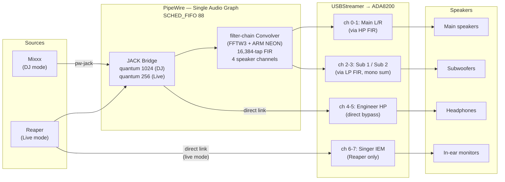

# Design Rationale

The DSP engine is PipeWire's built-in filter-chain convolver, running all FIR
processing natively within the PipeWire audio graph using FFTW3 with ARM NEON
SIMD optimization. The system previously used CamillaDSP as an external DSP
engine via an ALSA Loopback bridge, but
[BM-2 benchmarks](../lab-notes/LN-BM2-pw-filter-chain-benchmark.md) showed
PipeWire's convolver is 3-5.6x more CPU-efficient on Pi 4B ARM, and the
architectural simplification eliminates ~88ms of signal path latency in DJ mode
(D-040, 2026-03-16). For full configuration details, see
[`rt-audio-stack.md`](../architecture/rt-audio-stack.md).

This document tells the story of the technical decisions behind the Pi 4B audio
workstation -- why things are the way they are, what alternatives were considered,
and what tradeoffs were accepted. It is written for someone who wants to
understand the reasoning, not just the conclusions.

For the formal decision log with structured Context/Decision/Rationale/Impact
fields, see [decisions.md](../project/decisions.md). Everything here is
consistent with that log; this document simply tells the story in a way that
connects the dots between decisions.

---

## Signal Flow

The following diagram shows the audio signal path from application to speakers.
Both modes share the same pipeline; only the source application, PipeWire
quantum, and active channels differ.

The entire audio pipeline runs within a single PipeWire graph. No ALSA
Loopback, no external DSP process. The filter-chain convolver uses FFTW3 with
ARM NEON SIMD for non-uniform partitioned convolution.

**DJ mode** routes Mixxx stereo output through the convolver to the four speaker
channels (mains + subs). PipeWire natively sums the L+R inputs connected to
each sub channel for mono sum. Headphone channels bypass the convolver via
direct PipeWire links. PipeWire quantum 1024.

**Live mode** routes Reaper output through the convolver for the speaker
channels. Headphone and singer IEM channels bypass the convolver via direct
PipeWire links. PipeWire quantum 256.

The four speaker channels (0-3) receive FIR processing; the monitor channels
(4-7) bypass the convolver entirely via direct PipeWire links to the
USBStreamer.

---

## Background: The Concepts Behind the Decisions

Before diving into the design choices, here is a brief introduction to the
signal processing concepts that come up throughout this document.

**Crossover.** A speaker that is good at reproducing bass is physically
incapable of reproducing treble, and vice versa. A subwoofer's large, heavy
cone moves slowly enough to push air at 40Hz but cannot vibrate fast enough
for 4kHz. A tweeter's tiny diaphragm handles 4kHz effortlessly but would
tear itself apart trying to reproduce 40Hz. A crossover solves this by
splitting the audio signal by frequency before it reaches the speakers:
bass goes to the subwoofers, mid-to-high frequencies go to the main speakers.
Every multi-speaker PA system has a crossover somewhere in the chain.

**IIR and FIR filters.** These are two fundamentally different approaches to
digital filtering -- the mathematical operations that reshape an audio signal.
An IIR (Infinite Impulse Response) filter uses a compact formula with
feedback: each output sample depends on previous output samples as well as
the input. This makes IIR filters computationally cheap and responsive, but
their feedback structure imposes inherent constraints on phase behavior --
they cannot avoid delaying some frequencies more than others near the
crossover point. An FIR (Finite Impulse Response) filter uses a long list of
coefficients called "taps" that describe the filter's shape explicitly,
sample by sample. There is no feedback. This gives complete control over both
the frequency response and the phase behavior, but it costs more CPU because
every output sample requires multiplying the input by thousands of
coefficients. The number of taps determines how precisely the filter can
shape low frequencies: more taps means finer control at lower frequencies.

**Group delay.** When a filter processes audio, different frequencies may come
out at slightly different times. Group delay measures this timing spread. If
a filter has 4 milliseconds of group delay at 80Hz, that means energy at 80Hz
arrives 4ms later than energy at higher frequencies. For a steady tone this
is inaudible -- the ear does not perceive a constant delay. But for a
transient, it matters.

**Transients.** A transient is a sudden, sharp sound event: the attack of a
kick drum, a snare hit, a consonant in speech. Transients contain energy
across many frequencies simultaneously -- the initial "snap" of a kick drum
has content from 40Hz up through 8kHz. If a filter delays some of those
frequencies more than others (group delay), the transient's shape spreads
out in time. The sharp attack becomes a softer onset. For music that depends
on rhythmic precision and physical impact -- like psytrance -- preserving
transient shape matters.

**Room correction.** Every room changes how speakers sound. Hard parallel
walls create standing waves that make certain bass frequencies boom while
others nearly vanish. Surfaces reflect sound that interferes with the direct
signal, creating peaks and nulls in the frequency response that change from
seat to seat. Room correction measures these distortions with a calibrated
microphone and computes a filter that compensates -- attenuating the
frequencies the room amplifies so that what reaches the listener is closer
to the original recording.

**Why this matters for a PA system.** At a live event, the room is the
problem. Without correction, some positions in the audience get overwhelming
bass buildup while others get almost none. The crossover determines how
cleanly the signal splits between the subwoofers and the mains -- a poor
split wastes amplifier power and muddies the transition between drivers.
These are not audiophile niceties. They are the difference between a system
that sounds balanced across the venue and one that only sounds right at the
one spot where the engineer is standing.

## Why Combined FIR Filters Instead of a Separate IIR Crossover

The single most consequential decision in this project is how the audio signal
gets split between the main speakers and the subwoofers.

A crossover splits the audio signal by frequency, routing bass to the
subwoofers and mid-to-high frequencies to the main speakers. Both outputs are
filtered -- the subs receive only low frequencies, the mains receive only high
frequencies. Every PA system has one, and crossovers exist at different points
in the signal chain. Passive analog crossovers (capacitors, inductors,
resistors) live inside speaker cabinets between the amplifier and the
drivers -- still standard, still state of the art for that application.
Active digital crossovers split the signal before amplification, allowing each
driver to have its own amplifier channel. The standard approach for active
digital crossovers is IIR (Infinite Impulse Response) filters -- typically
[Linkwitz-Riley](https://en.wikipedia.org/wiki/Linkwitz%E2%80%93Riley_filter) designs that use a compact mathematical formula to split
frequencies with precision. PA processors like dbx DriveRack, Behringer DCX,
and the DSP built into systems from [d&b audiotechnik](https://www.dbaudio.com/) and [L-Acoustics](https://www.l-acoustics.com/) all use
IIR crossovers effectively, including at psytrance events.

IIR crossovers would have been the natural choice here, except that this
system also needs per-venue room correction -- and that changes the calculus.

With an IIR crossover, room correction requires a separate FIR convolution
stage after the crossover. The signal passes through two processing stages:
first the IIR crossover splits the frequencies, then a FIR filter corrects
for the room. Two stages means more CPU load, more latency, more numerical
artifacts at each stage boundary, and no opportunity to co-optimize the
crossover and the room correction. The crossover and correction are designed
independently, even though they interact -- the crossover's phase response
affects what the room correction filter needs to do.

Many commercial DSP processors in the mid-range price bracket limit FIR
filters to 512-1,024 taps due to fixed-point DSP hardware constraints (for
example, the Behringer DEQ2496 at 512 taps, or the miniDSP 2x4 HD at 2,048
taps per channel). High-end touring processors support longer filters, but
at significantly higher cost and with proprietary toolchains.

This system achieves 16,384-tap FIR convolution on a Raspberry Pi 4B --
enabled by PipeWire's built-in filter-chain convolver using FFTW3 with
hand-optimized ARM NEON codelets, running on a general-purpose ARM processor
rather than a dedicated DSP chip. The longer filter length makes something
practical that shorter filters cannot achieve: combining the crossover slope
and room correction into a single convolution per output channel.

**The combined minimum-phase FIR approach** integrates both functions into one
filter. The crossover shape and the room correction are co-optimized: the
filter generator accounts for crossover-room interactions and produces a single
combined result. Fewer processing stages means fewer numerical artifacts and
lower CPU load -- a meaningful advantage on a Raspberry Pi where every
processing cycle counts.

A secondary benefit is reduced group delay. An IIR Linkwitz-Riley crossover
introduces approximately 4ms of group delay at 80Hz -- different frequencies
near the crossover point arrive at slightly different times. Minimum-phase FIR
achieves the same frequency split with about 1-2ms of group delay. Whether
this difference is audible in isolation is debatable: psychoacoustic research
places the audibility threshold near one full cycle period (12.5ms at 80Hz),
and real-world speaker placement introduces comparable timing variations. But
lower group delay is objectively better when achievable at no additional cost,
and in a system optimized for bass-heavy psytrance, every improvement in
transient fidelity is worth taking.

A third benefit is the absence of pre-ringing. **Linear-phase FIR** -- the
other common FIR approach -- introduces zero group delay but produces
pre-ringing: a faint echo of the transient that arrives *before* the transient
itself. At 80Hz, this pre-echo is about 6 milliseconds ahead of the kick.
Human hearing is surprisingly sensitive to sounds that arrive before the event
that caused them. Minimum-phase FIR avoids this entirely.

The tradeoff of the combined minimum-phase FIR approach is that the crossover
frequency cannot be adjusted at runtime; changing the crossover point requires
regenerating the FIR filter coefficients. For systems that do not need room
correction, or where crossover flexibility matters more than combined-filter
efficiency, IIR remains the practical choice.

The combined-filter approach is the project's most consequential decision
(D-001). It was made before any hardware testing, but was explicitly marked as
conditional on CPU validation (D-007) -- if the Pi 4B could not handle the FIR
convolution load, the project would have fallen back to IIR crossovers. The benchmarks (US-001) confirmed
that the Pi handles the combined FIR convolution easily: about 5% CPU in DJ
mode, about 19% in live mode with the benchmark configuration (2-channel
capture). The production configuration with full 8-channel capture and mixing
raises live mode to approximately 34% -- still well within budget.

## Filter Length: Why 16,384 Taps

A FIR filter is essentially a list of numbers (called taps or coefficients) that
describe how to reshape audio, sample by sample. More taps mean more precision
at lower frequencies. Fewer taps save CPU but lose control over the bass.

The relationship is straightforward: at 48,000 samples per second, a 16,384-tap
filter spans 341 milliseconds. To correct a frequency effectively, you need the
filter to contain several complete cycles of that frequency. At 30Hz, 16,384
taps give you 10.2 cycles -- more than enough for solid correction. At 20Hz,
you get 6.8 cycles -- adequate, if not generous.

The fallback was 8,192 taps: half the length, half the CPU cost, but only 3.4
cycles at 20Hz. That is marginal. It would work in venues where 20Hz correction
is not critical (most live venues do not reproduce much useful content below
25Hz), but it would struggle in rooms with strong sub-bass room modes.

The benchmarks settled the question decisively. PipeWire's filter-chain
convolver processes 16,384-tap FIR on four channels at 1.70% CPU in DJ mode
(quantum 1024) and 3.47% in live mode (quantum 256)
([BM-2](../lab-notes/LN-BM2-pw-filter-chain-benchmark.md)). There is no CPU
pressure to compromise on filter length.

The 16,384-tap filter length (D-003), like the combined-filter approach, was
validated by the US-001 CPU benchmarks and made conditional on hardware
validation (D-007) pending those results.

## Four Independent Correction Filters

Every output channel gets its own combined FIR filter -- left main, right main,
sub 1, and sub 2. Each filter integrates both the crossover slope and the room
correction for that specific channel. The left main gets a highpass crossover
combined with whatever room correction the left speaker needs in this venue.
The right main gets its own highpass with its own correction. Each sub gets a
lowpass crossover combined with its own correction. Four speakers, four filters,
four independent measurements.

This per-channel approach is essential because every speaker interacts with the
room differently. Even the left and right mains, which are nominally symmetric,
see different boundary conditions -- one might be near a reflective wall while
the other faces an open doorway. A single "main speaker" correction applied to
both would overcorrect one and undercorrect the other.

The independence is especially important for subwoofers. A sub in a corner gets
significant bass reinforcement from the walls -- typically 6-12dB of gain below
100Hz. A sub in the middle of a wall gets less. Two subs at different positions
see two entirely different rooms. Each sub also sits at a different distance
from the listening position, requiring its own delay value and gain trim. Both
subs receive the same mono sum of the left and right channels as source material
-- there is no stereo information to preserve in the sub-bass range.

The per-channel independent correction approach (D-004) means the measurement pipeline must
measure each output independently: four sweeps, four impulse responses, four
correction filters.

## Latency: A Singer's Perspective

Latency -- the delay between a sound entering the system and leaving the
speakers -- is irrelevant to the audience at a DJ set. A 21-millisecond delay
is equivalent to standing about 7 meters from the speaker stack. Nobody notices.

For a live vocalist, the situation is entirely different. The singer hears
her own voice through three paths simultaneously. The first is bone
conduction: vibrations from her vocal cords travel through her skull to her
inner ear in effectively zero time. The second is her in-ear monitors: the
microphone signal travels through the digital audio chain. The third is the
PA speakers: the signal travels through the DSP pipeline and then through the
room air to her ears.

If the electronic paths lag too far behind bone conduction, the singer
perceives a distinct echo of her own voice. This is not a subtle effect. It
is like singing in a tiled bathroom -- every note comes back a fraction of a
beat late, making it nearly impossible to maintain rhythm and pitch. For Cole
Porter material, where the vocalist needs precise phrasing against backing
tracks, this is performance-destroying.

The architecture change to PipeWire's filter-chain convolver (D-040)
transformed the latency picture. In the previous architecture, CamillaDSP
held exclusive ALSA access to all eight USBStreamer channels -- both the
speaker channels (with FIR processing) and the monitor channels (passthrough).
This meant the singer's IEM path had to transit CamillaDSP regardless,
adding two chunks of buffering latency even for passthrough channels.

With the current PipeWire-native architecture, the IEM channels bypass the
convolver entirely via direct PipeWire links to the USBStreamer. The singer's
IEM path is just one PipeWire quantum: about 5ms at quantum 256. The PA path
through the convolver is also about 5.3ms -- the filter-chain convolver
processes synchronously within the same PipeWire graph cycle, adding no
additional buffering latency.

The result is dramatic. At quantum 256 (live mode), the PA path delay is
approximately 5.3ms -- far below the ~25ms slapback threshold. The previous
architecture required aggressive buffer tuning to achieve ~22ms; the new
architecture achieves ~5.3ms at the same quantum. This was the primary
motivation for the architecture change.

In DJ mode, PipeWire quantum 1024 gives approximately 21ms of PA path
latency -- down from ~109ms in the previous architecture, which added ~88ms
of ALSA Loopback bridge and CamillaDSP buffering. Live mode uses quantum 256
(D-011) for the lowest latency.

## Cut-Only Correction: Why the Filters Never Boost

Psytrance is among the loudest-mastered genres in electronic music. Tracks
routinely arrive at -0.5 LUFS -- within half a decibel of digital full scale
(0 dBFS). This leaves effectively zero headroom.

If a room correction filter boosts any frequency by even 1dB, the boosted
signal exceeds 0 dBFS and clips. Digital clipping is not the gentle saturation
of an analog amplifier; it is a hard wall. The waveform is truncated, producing
sharp harmonic distortion that is immediately and painfully obvious on a PA
system at volume.

The solution is straightforward: all correction filters operate by cut only.
Room peaks -- frequencies where the room amplifies the sound -- are attenuated.
Room nulls -- frequencies where the room cancels the sound -- are left alone.

This is less of a compromise than it sounds. Room peaks are the dominant
audible problem. When a 60Hz room mode adds 12dB of boom to every kick drum,
cutting that peak is what makes the kick sound clean. The nulls, by contrast,
are position-dependent: a null at the measurement position may be a peak two
meters away. Boosting a null wastes amplifier power to fix a problem that only
exists at one spot in the room.

The filters enforce a -0.5dB safety margin: no frequency bin may exceed -0.5dB
of gain. This margin accounts for FIR truncation ripple (the Gibbs phenomenon
at the filter edges), numerical precision limits, and the possibility that a
track might be mastered even louder than -0.5 LUFS.

Target curves -- the desired tonal balance of the system -- are implemented as
relative attenuation rather than boost. Instead of "boost bass by 3dB," the
system "cuts midrange and treble by 3dB relative to bass." The perceptual
result is identical, but the digital signal level stays below 0 dBFS. The
lost loudness is recovered by turning up the analog amplifier gain -- the
amplifier has headroom to spare.

The cut-only correction policy -- all filters at or below -0.5dB gain at every
frequency (D-009) -- supersedes an earlier assumption that allowed up to +12dB
of boost.

## Room Correction Theory

The previous sections explain *what* the correction filter does (cut peaks,
preserve phase, combine with crossover). This section explains *how* the
correction is computed from a room measurement -- the signal processing
theory that turns a microphone recording into a useful filter.

### From Measurement to Impulse Response

The measurement pipeline plays a logarithmic sine sweep (20Hz to 20kHz)
through each speaker individually and records the result with a calibrated
microphone (UMIK-1). Deconvolving the recorded signal with the original
sweep produces the room's impulse response for that speaker-microphone
path -- a complete characterization of how the room transforms sound from
that speaker to that position.

The impulse response contains everything: the direct sound from the
speaker, early reflections off nearby surfaces, late reverberation from
the room, and the frequency response distortions caused by standing waves
and boundary effects. The correction filter's job is to undo the
distortions that are consistent and correctable, while leaving alone those
that are not.

### Frequency-Dependent Windowing

Not all parts of the impulse response are equally useful for correction.
The direct sound and early reflections (arriving within roughly 5-10ms of
the direct sound) represent the consistent acoustic behavior of the
speaker-room combination. Late reflections (arriving after 20-50ms) are
diffuse and position-dependent -- they change if the microphone moves by
a few centimeters.

Correcting for late reflections at a single measurement point makes things
*worse* everywhere else. The correction creates a new set of comb-filter
artifacts tuned to cancel the reflections at the exact mic position, but
those same corrections add constructive interference a meter away.

The solution is frequency-dependent windowing of the impulse response
before computing the inverse. The window length varies with frequency:

- **Below ~300Hz:** Long window (captures several room mode cycles). Room
  modes are standing waves between parallel surfaces. They are spatially
  broad -- the same mode affects a large area of the room similarly. They
  are also the dominant problem: a 60Hz room mode can add 12dB of boom
  that is audible everywhere. These are aggressively corrected.

- **Above ~300Hz:** Short window (captures only the direct sound and
  earliest reflections). Individual reflections at higher frequencies
  create narrow comb-filter patterns that shift with any positional change.
  The correction only addresses broad speaker response deviations
  (frequency response shape of the driver itself), not individual
  reflection artifacts.

This approach -- aggressive correction of spatial modes at low frequencies,
gentle smoothing at high frequencies -- matches the physics of how rooms
distort sound. Low-frequency problems are global (the whole room hears
them); high-frequency problems are local (they depend on exact position).

### Psychoacoustic Smoothing

Before computing the inverse of the measured response, the response is
smoothed using fractional-octave averaging. This prevents the correction
filter from chasing narrow-band artifacts that are not perceptually
relevant.

Human hearing does not resolve individual frequency bins the way an FFT
does. Instead, the ear integrates energy within critical bands whose width
increases with frequency. A sharp 3dB notch at 4,137Hz is inaudible; a
broad 3dB tilt across 2-8kHz is obvious. The smoothing matches the
correction's resolution to what the ear can perceive.

The smoothing bandwidth increases with frequency:

| Frequency Range | Smoothing | Rationale |
|----------------|-----------|-----------|
| Below 200Hz | 1/6 octave | Room modes are narrow; fine resolution needed to target them |
| 200Hz - 1kHz | 1/3 octave | Transition region; moderate resolution sufficient |
| Above 1kHz | 1/2 octave | Reflections dominate; broad smoothing prevents overcorrection |

Smoothing also improves the correction's spatial robustness. A correction
filter that matches every narrow peak and dip at the measurement position
is fragile -- it becomes wrong as soon as the listener moves. A
smoothed correction targets only the broad spectral shape, which is more
consistent across the listening area.

### Regularization

Regularization prevents the correction filter from attempting physically
impossible corrections. When the room measurement shows a deep null (a
frequency where destructive interference nearly cancels the sound), the
naive inverse would require enormous boost at that frequency -- boost that
wastes amplifier power, risks clipping, and only works at one point in
space.

The system uses cut-only regularization (D-009): the correction filter
may only attenuate, never boost. Room peaks are cut; room nulls are left
uncorrected. A -0.5dB safety margin ensures no frequency bin exceeds
-0.5dB gain, accounting for FIR truncation ripple and numerical precision.

This is more aggressive than the regularization used in many room
correction systems, which allow moderate boost (typically 3-6dB) at
nulls. The cut-only constraint is driven by the source material:
psytrance mastered at -0.5 LUFS leaves zero headroom for any boost
without clipping. The correction sacrifices null correction for absolute
safety against digital clipping at PA power levels.

### Minimum-Phase Consistency

The correction filter must be minimum-phase at every stage of the
computation. If any step introduces linear-phase or mixed-phase behavior,
the resulting filter will have pre-ringing -- energy that arrives before
the event that caused it.

The minimum-phase chain:

1. **UMIK-1 calibration:** Magnitude-only correction file (inherently
   minimum-phase when applied as a magnitude adjustment).
2. **Measured impulse response:** The minimum-phase component is extracted
   from the measured IR, discarding the excess-phase component that
   represents arrival time and room reflections.
3. **Computed inverse:** The inverse of a minimum-phase response is itself
   minimum-phase.
4. **Crossover shape:** Designed as a minimum-phase FIR (the crossover
   slope is synthesized directly in the minimum-phase domain).
5. **Combined filter:** The magnitude spectra of correction and crossover
   are multiplied (equivalent to time-domain convolution). The combined
   magnitude is clipped to satisfy D-009, then a new minimum-phase FIR
   is synthesized directly from this clipped magnitude using the cepstral
   method (IFFT of log magnitude, causal windowing, exponentiation). This
   builds the minimum-phase filter from scratch rather than converting an
   existing impulse response -- synthesizing from magnitude produces the
   mathematically optimal result without the artifacts that come from
   discarding phase information in a mixed-phase IR.

If the mic calibration were applied as a complex (magnitude + phase)
correction, or if the crossover were designed as a linear-phase filter,
the combined result would contain pre-ringing. Consistency across the
entire chain is what makes the final filter clean.

## Time Alignment

When multiple speakers reproduce the same signal, their sound must arrive
at the listening position simultaneously. If the subwoofers are 2 meters
further from the listener than the main speakers, their sound arrives
about 5.8ms later. This time offset causes destructive interference at
the crossover frequency -- the bass from the subs partially cancels the
bass from the mains, creating a dip in the response exactly where the
two drivers overlap.

Time alignment compensates for this by adding digital delay to the
closer speakers so that all arrivals coincide.

### Measuring Arrival Time

The measurement pipeline determines each speaker's arrival time from its
impulse response. The onset of energy in the impulse response corresponds
to the moment sound first reaches the microphone. The pipeline detects
this onset for each speaker individually.

### Computing Delays

The furthest speaker (latest arrival) becomes the reference with delay
zero. All other speakers receive positive delay equal to the difference
between their arrival time and the reference. This ensures no speaker
needs negative delay (which would require predicting the future).

For example, if the main speakers arrive at 8.2ms and the subwoofers at
14.0ms:

- Subwoofers: delay = 0ms (reference, furthest)
- Main speakers: delay = 14.0 - 8.2 = 5.8ms

PipeWire's filter-chain convolver applies these delays as sample-accurate
offsets configured in the convolver config file.

### Why Per-Speaker Delays

Each speaker gets its own delay value because each is at a different
distance from the listening position. Even the left and right mains may
be at slightly different distances if the PA setup is not perfectly
symmetric (which it rarely is in a live venue). The two subwoofers are
typically at very different positions -- one near a wall, one in a
corner -- and may differ by several milliseconds.

The delays are regenerated at every venue along with the correction
filters. Speaker placement changes between gigs, and even small changes
(moving a sub 30cm) shift the arrival time by nearly a millisecond.

### Temperature Effects

The speed of sound varies with temperature: 343 m/s at 20C, 349 m/s at
30C (a 1.7% increase). For a speaker 5 meters from the microphone, this
changes the arrival time by approximately 0.25ms -- below the threshold
of audible impact for crossover alignment but worth noting for
documentation completeness. The measurement pipeline measures actual
arrival times rather than computing them from distance, so temperature
effects are captured implicitly.

## Speaker Profiles: One Pipeline, Many Configurations

The system is designed to work at different venues with different speaker
combinations. One gig might use sealed subwoofers with an 80Hz crossover;
another might use ported subs that need a 100Hz crossover and subsonic
protection below the port tuning frequency.

Rather than hardcoding these parameters, the measurement pipeline accepts a
named speaker profile -- a YAML file that specifies crossover frequency,
slope steepness, speaker type (sealed or ported), port tuning frequency (if
applicable), and target SPL. Pre-defined profiles cover common configurations,
with a custom override for anything unusual.

### Driver Protection Filters: A Safety Requirement

All speaker configurations MUST include appropriate driver protection filters.
This is a safety requirement, not an optimization.

**Subwoofers (all enclosure types):** A highpass filter (HPF) below the
driver's usable bandwidth is mandatory. The `mandatory_hpf_hz` field in the
speaker identity schema declares the cutoff frequency. The HPF is embedded
in the combined FIR filter and cannot be bypassed or omitted.

- **Ported subwoofers:** HPF below the port tuning frequency. Without it,
  the driver unloads -- the air in the port stops providing the restoring
  force that keeps the cone from over-excursing. Result: mechanical damage.
- **Sealed subwoofers with small drivers:** HPF below the driver's
  mechanical limit (Xmax). Small sealed-box drivers (e.g., 5.25" isobaric)
  have limited excursion and receive full-bandwidth signal without rolloff
  from the enclosure. Subsonic content causes over-excursion even in a
  sealed enclosure. The Bose PS28 III deployment exposed this gap: the
  5.25" isobaric drivers were receiving full-bandwidth signal through a
  dirac placeholder FIR (pre-measurement), with no protection below 42 Hz.
- **Large sealed subwoofers:** May omit the HPF if the driver's Xmax is
  sufficient for the full amplifier output at all frequencies. This is the
  exception, not the rule.

**Satellites:** A highpass filter at or above the crossover frequency is
mandatory. This limits low-frequency content that the satellite drivers
cannot reproduce and that wastes amplifier power. For the crossover to
function correctly, this HPF is inherent in the crossover filter design.

**Critical gap in dirac placeholder configs (D-031):** When FIR filters are
dirac placeholders (pre-measurement), NO crossover filtering occurs. Subs
receive full-bandwidth signal including subsonic content. Satellites receive
full-bandwidth signal including bass. Production configs using dirac
placeholders MUST include IIR protection filters as a safety net until real
FIR filters are measured and deployed. The config generator pipeline MUST
enforce this: any speaker identity with `mandatory_hpf_hz` triggers an IIR
Butterworth HPF in the PipeWire filter-chain pipeline regardless of enclosure
type. See D-031 for the formal decision and D-029 for the gain staging
framework.

Three-way speaker support (separate drivers for bass, midrange, and treble)
is deferred to Phase 2. A three-way configuration requires six speaker output
channels, leaving only two for monitoring -- incompatible with the live mode
requirement for both engineer headphones and singer in-ear monitors. Three-way
will be available in DJ mode only.

The speaker profile system (D-010) means the 80Hz crossover from the
combined-filter decision (D-001) becomes a default value rather than a fixed
parameter.

## Per-Venue Measurement: Nothing Carried Over

Room correction filters are regenerated fresh at every venue. Nothing is
carried over from the previous gig.

This might seem wasteful -- why not save filters from a venue you have played
before? Three reasons:

First, venues change. Tables and chairs get rearranged. The PA gets placed
in a different spot. The audience size varies. All of these affect the room's
acoustic behavior.

Second, the system itself changes. A kernel update might shift USB timing by
a fraction of a millisecond. A PipeWire update might change internal buffering.
The measurement pipeline includes a loopback self-test that detects system-level
drift, ensuring that the platform behaves as expected before any room
measurements begin.

Third, fresh measurements eliminate an entire class of bugs. There is no
stale-config file that was generated for a different speaker placement, no
forgotten delay value from a room that no longer exists. Every parameter is
derived from the current reality.

Historical measurements are archived for regression detection -- if a venue's
measurements look dramatically different from last time, something has changed
and the operator should investigate -- but the archived data never drives the
live system.

The per-venue fresh measurement policy (D-008) means the filter WAV files in
`/etc/pi4audio/coeffs/` are runtime-generated artifacts, never
version-controlled. The measurement pipeline scripts and their parameters
(calibration files, target curves, crossover settings) are the
version-controlled source of truth.

## Hardware Validation: Decisions Made Conditionally

Several of the decisions above -- FIR filters instead of IIR crossovers, 16,384
taps, chunksize 256 in live mode -- were made before any hardware testing. They
were engineering judgments based on upstream benchmarks and theoretical analysis,
not measured reality.

This created a risk: what if the Pi 4B could not handle the load? The project
explicitly acknowledged this by marking the combined-filter approach (D-001),
the dual chunksize strategy (D-002), and the 16,384-tap filter length (D-003)
as conditional on hardware validation (D-007). The test stories (US-001 for
CPU benchmarks, US-002 for latency measurement, US-003 for stability) were
prioritized before any room correction pipeline work began.

The CPU and latency results validated the design with margin to spare. The
initial CamillaDSP benchmarks (US-001) showed 5.23% CPU at chunksize 2048 and
19.25% at chunksize 256 -- already within budget. The subsequent architecture
pivot to PipeWire's filter-chain convolver (D-040) improved these numbers
dramatically:

- PW convolver at quantum 1024 (DJ mode): 1.70% CPU (BM-2)
- PW convolver at quantum 256 (live mode): 3.47% CPU (BM-2)
- Full DJ session (GM-12): 58.5% system idle with Mixxx + convolver
- PA path latency: ~21ms DJ, ~5.3ms live (vs ~109ms / ~22ms previously)

The fallback paths (8,192 taps, higher quantum) were never needed. But having
them defined in advance meant the project was never at risk of a dead end --
there was always a viable next step if the primary configuration had failed.

The conditional validation approach (D-007) ensured that the design decisions
were always backed by a tested fallback path.

## The Team Structure Decisions

This project is built by an AI-orchestrated team with specialized roles. Two
decisions shaped the team composition.

The initial team composition (D-005) established the core advisory team: a Live Audio Engineer who ensures
every signal processing decision serves the goal of a successful live event,
and a Technical Writer who maintains the documentation suite and records
experiment results. Both have blocking authority -- the audio engineer can
block on signal processing errors, the technical writer can block on
documentation inaccuracy that could lead to incorrect configuration.

A subsequent expansion (D-006) added roles in response to identified gaps. A Security
Specialist was added because the Pi runs on untrusted venue WiFi networks with
SSH, VNC, and websocket services exposed -- a proportionate threat given the
risk is reputation damage, not nation-state attack. A UX Specialist was added
because the interaction model spans MIDI grids, DJ controllers, headless
systemd services, web UIs, and remote desktop -- designing coherent workflows
across that surface area needs dedicated attention. A Product Owner was added
for structured story intake. The Architect's scope was expanded to include
real-time performance on constrained hardware, since a Pi 4B under sustained
DSP load is fundamentally a real-time systems challenge.

## Tool Choices and Real-Time Configuration

### Why PipeWire

[PipeWire](https://pipewire.org/) is the audio server -- the software layer that routes audio between
applications and hardware devices. It replaced both JACK and PulseAudio on
this system, providing a single server that speaks both protocols.

[Mixxx](https://mixxx.org/) and [Reaper](https://www.reaper.fm/) connect to PipeWire through its JACK bridge, seeing the same
JACK API they would on a dedicated JACK server. [RustDesk](https://rustdesk.com/) (the remote desktop
tool) connects through PipeWire's PulseAudio compatibility layer. This dual
compatibility eliminates the need to run two audio servers simultaneously, as
earlier Linux audio setups often required.

PipeWire's **quantum** parameter controls the audio buffer size at the server
level, measured in samples. At 48kHz, a quantum of 256 means PipeWire
processes audio in chunks of 256 samples (5.3 milliseconds). Lower quantum
means lower latency but higher CPU overhead from more frequent processing
cycles. The system uses quantum 256 for live mode and quantum 1024 for DJ
mode, switched by loading different PipeWire configuration files.

A critical architectural detail: PipeWire is both the audio server AND the DSP
engine. Its built-in filter-chain convolver handles all FIR processing (crossover
+ room correction) within the same audio graph, using FFTW3 with hand-optimized
ARM NEON codelets for non-uniform partitioned convolution. The convolver processes
synchronously within the graph cycle, adding no additional buffering latency.
This single-graph architecture means PipeWire controls the entire signal path
from application input through DSP processing to hardware output.

### Why PipeWire's Filter-Chain Convolver (D-040)

The system originally used [CamillaDSP](https://github.com/HEnquist/camilladsp)
as an external DSP engine, connected to PipeWire via an ALSA Loopback bridge.
CamillaDSP is an excellent tool -- it provides partitioned FFT convolution,
multi-channel pipeline management, and a websocket API for runtime control.
However, the ALSA Loopback bridge architecture imposed significant constraints:

- **Latency overhead:** CamillaDSP's ALSA-native design requires two chunks of
  internal buffering (capture fill + playback drain). In DJ mode at chunksize
  2048, this added ~85ms of latency on top of the PipeWire quantum.
- **Exclusive ALSA access:** CamillaDSP held exclusive access to all eight
  USBStreamer channels. Monitor channels (headphones, IEM) had to transit
  CamillaDSP as passthrough even though they needed no processing.
- **Dual-graph complexity:** Two separate audio engines (PipeWire + CamillaDSP)
  running at different priorities with an ALSA Loopback bridge between them,
  requiring careful buffer coordination.
- **FFT implementation gap:** CamillaDSP uses
  [RustFFT](https://crates.io/crates/rustfft), which relies on LLVM
  auto-vectorization for ARM NEON. PipeWire's convolver uses
  [FFTW3](https://www.fftw.org/), which has hand-optimized ARM NEON codelets.

[BM-2 benchmarks](../lab-notes/LN-BM2-pw-filter-chain-benchmark.md) quantified
the difference: PipeWire's convolver is 3-5.6x more CPU-efficient than
CamillaDSP at comparable buffer sizes (1.70% vs 5.23% at quantum/chunksize
1024). The first successful PW-native DJ session
([GM-12](../lab-notes/GM-12-dj-stability-pw-filter-chain.md)) ran 40+ minutes
with zero xruns, 58% idle CPU, and 71C temperature.

**Alternatives considered but not chosen:**

**BruteFIR** is an older Linux FIR convolution engine with a solid reputation.
It handles convolution well but lacks an integrated processing pipeline --
mixing, delay, and routing require additional tools. It also has no runtime
API, meaning filter changes require stopping and restarting the process.

**Hardware DSP processors** (miniDSP, dbx, Behringer DCX) are purpose-built
for crossover and EQ but have fixed filter lengths (typically 1,024 taps or
fewer) and no automation API. They cannot run the 16,384-tap combined filters
this project requires, and integrating them into an automated measurement
pipeline would require external control software that does not exist.

### How Partitioned Convolution Works

Partitioned overlap-save FFT convolution is the algorithm that makes
16,384-tap FIR filters feasible on a Raspberry Pi. Instead of multiplying
each output sample by all 16,384 coefficients (which would require over 3
billion multiply-accumulate operations per second for four channels at 48kHz),
the convolver converts the filter to the frequency domain using FFT (Fast
Fourier Transform) and performs the convolution as element-wise multiplication.
The "partitioned" part means it splits the long filter into segments and
overlaps them correctly -- this keeps latency low while still convolving
against the full filter length. The O(N log N) scaling of FFT versus O(N x M)
scaling of direct convolution gives roughly a 100x reduction in operations
for a 16,384-tap filter.

PipeWire's filter-chain convolver uses FFTW3's single-precision library
(`libfftw3f`) with hand-tuned ARM NEON SIMD codelets. At quantum 1024 (DJ
mode), the convolver uses 1.70% of one CPU core for four channels of 16,384-tap
FIR. At quantum 256 (live mode), it uses 3.47%. These numbers represent the
convolver process in isolation; the full PipeWire daemon under real DJ workload
uses about 42% of one core including graph scheduling, JACK bridge, and device
I/O ([GM-12](../lab-notes/GM-12-dj-stability-pw-filter-chain.md)).

### Real-Time Configuration: What We Do and What We Skip

"Real-time audio" on Linux means the system must finish processing each audio
buffer before the next one arrives. If it misses a deadline, the result is an
audible glitch -- a click, pop, or dropout called an **xrun** (buffer
underrun or overrun). The challenge is not raw processing speed (the Pi has
plenty) but ensuring consistent, uninterrupted access to CPU time.

**What we configure:**

**FIFO scheduling at priority 83-88.** Linux's default scheduler treats all
processes roughly equally, occasionally pausing one to run another. For audio,
this is unacceptable -- a 5ms pause while the kernel runs a background task
means a missed audio deadline. FIFO (First In, First Out) scheduling at high
priority tells the kernel: this process runs until it voluntarily yields, and
it preempts anything with lower priority. RTKit (the Real-Time Kit daemon)
grants PipeWire these elevated priorities without requiring it to run as root.
The priority range 83-88 is high enough to preempt all normal processes but
below the kernel's own real-time threads (priority 99), which must not be
starved.

**Per-mode quantum.** DJ mode runs PipeWire at quantum 1024 -- large buffers
that give the system ample time to process each cycle. Live mode drops to
quantum 256 for lower latency, accepting higher CPU overhead from more frequent
processing cycles. The quantum is the single latency-controlling parameter;
the filter-chain convolver processes within the same graph cycle. Switching
between modes is done at runtime via `pw-metadata`.

**Memory locking (memlock).** Audio buffers must stay in physical RAM, never
swapped to the SD card. Swapping introduces milliseconds of latency that
would cause xruns. The `memlock` ulimit allows audio processes to lock their
memory pages, and `swappiness` is reduced to discourage the kernel from
swapping under memory pressure.

**Service trimming.** Unnecessary services (Avahi, ModemManager, CUPS, rpcbind)
are disabled to eliminate background CPU and I/O activity that could interfere
with audio processing. The desktop environment is stripped to a minimal labwc
Wayland compositor running as a user service.

**PREEMPT_RT kernel (D-013).** The system drives amplifiers capable of
producing SPL levels that can cause permanent hearing damage. This makes
scheduling determinism a safety requirement, not a performance optimization.
The PREEMPT_RT patch transforms the Linux kernel into a hard real-time system
with guaranteed worst-case scheduling latency -- typically under 50
microseconds. It achieves this by converting kernel spinlocks to sleeping
mutexes and making hardware interrupt handlers run as schedulable threads, so
that a high-priority audio process is never blocked by kernel-internal work.
Every processing deadline is met, always.

The stock PREEMPT kernel (which Raspberry Pi OS also ships) provides good
average scheduling performance with FIFO priority, but it does not guarantee
worst-case behavior. US-003 T3c confirmed a steady-state underrun at quantum
128 on stock PREEMPT -- the kernel cannot guarantee the 5.33ms processing
deadline under all conditions. On a system connected to high-power amplifiers,
"probably fine" is not acceptable.

Raspberry Pi OS Trixie provides the RT kernel as a matching package
(`linux-image-6.12.47+rpt-rpi-v8-rt`) -- the same kernel version as the stock
kernel, installable via `apt` with the stock kernel retained as a fallback for
development and benchmarking. No custom kernel build is required. The RT
kernel must be installed and validated (US-003 T3e) before the system is
connected to amplifiers at any venue.

**What we do not configure:**

**No CPU isolation or IRQ pinning.** On systems with very tight budgets,
dedicating specific CPU cores to audio and pinning hardware interrupts to
other cores can reduce jitter. With approximately 66% headroom at production
live mode load, this level of optimization is unnecessary and adds operational
complexity.

**No force_turbo.** The Pi 4B's dynamic frequency scaling briefly drops clock
speed during idle periods. Forcing the CPU to run at maximum frequency
continuously would eliminate the sub-millisecond ramp-up time when processing
resumes, but it increases power consumption and heat generation for a benefit
that is irrelevant with our headroom margins.

**No custom kernel builds.** The PREEMPT_RT kernel is installed as a standard
Raspberry Pi OS package, not a custom build. All necessary audio drivers are
included. Building a custom kernel with additional patches would create a
maintenance burden with no measurable benefit at our operating point.

The theme is clear: these remaining items are optimizations we do not need
because the system has approximately 66% headroom at its most demanding
operating point (live mode with production 8-channel configuration). The
critical safety item -- PREEMPT_RT -- is configured above. If future changes
reduced the remaining headroom (more channels, longer filters, additional
processing stages), CPU isolation or force_turbo could be revisited.

### How Hard Is the Real-Time?

This is a **hard real-time** system with **human safety implications**.

The system drives amplifiers capable of producing SPL levels that can cause
permanent hearing damage. While a single buffer underrun produces only a brief
discontinuity (PipeWire outputs silence during underruns), the broader failure
analysis encompasses software crashes, malformed filters, gain structure
errors, and driver bugs -- any of which can produce sustained dangerous
acoustic output. The system addresses this through a PREEMPT_RT
kernel (D-013) that guarantees scheduling determinism, combined with a
calibrated gain structure procedure that limits the maximum acoustic output
to safe levels. A hardware limiter between the audio output and the amplifiers
is deferred (D-014) until the system scales to higher-power PAs capable of
producing over 110dB SPL at audience position.

Professional digital mixing consoles (Yamaha CL/QL, Allen & Heath dLive,
DiGiCo SD) all operate under the same hard real-time model -- zero missed
deadlines is the operational target, not a stretch goal.

The processing budget at quantum 256 and 48kHz is 5.33 milliseconds per graph
cycle. PipeWire must finish the entire graph -- convolver FIR processing on
four speaker channels, link routing, and device I/O -- within that window. The
PW filter-chain convolver uses 3.47% of one CPU core at quantum 256
([BM-2](../lab-notes/LN-BM2-pw-filter-chain-benchmark.md)). The first DJ
session on the new architecture
([GM-12](../lab-notes/GM-12-dj-stability-pw-filter-chain.md)) showed 58.5%
system idle at quantum 1024 with Mixxx running -- substantial headroom.

The threats to real-time performance, ranked by likelihood:

1. **Thermal throttling.** The Pi 4B reduces its clock speed from 1.8GHz to
   1.5GHz (or lower) when the CPU temperature exceeds 80C. In a flight case
   at a warm venue, sustained processing could push temperatures into the
   throttling range. This is the most likely threat and is addressed by
   thermal testing in the flight case (US-003, T4).

2. **USB contention.** The USBStreamer, UMIK-1 measurement microphone, and
   three MIDI controllers all share the Pi's USB bus. Heavy USB traffic during
   a measurement cycle (streaming audio while reading the microphone) could
   cause bus contention that delays audio delivery. During normal performance,
   only the USBStreamer and one MIDI controller are active.

3. **PipeWire graph renegotiation.** When PipeWire's internal routing graph
   changes (a new application connects, a device appears or disappears),
   PipeWire briefly pauses audio processing to reconfigure. This typically
   takes under 1ms but can cause a single xrun if it coincides with a
   processing deadline.

4. **Scheduling jitter.** With the PREEMPT_RT kernel (D-013), worst-case
   scheduling latency is bounded to under 50 microseconds -- negligible
   relative to the 5.33ms processing deadline. On a stock PREEMPT kernel,
   occasional delays of a millisecond or more would be possible during heavy
   kernel activity. PREEMPT_RT eliminates this threat by converting kernel
   spinlocks to sleeping mutexes and threading hardware interrupt handlers.

5. **Memory pressure.** If system memory becomes scarce and the kernel needs
   to reclaim pages, the resulting I/O activity could briefly compete with
   audio processing. With 3.4GB available after all services are running,
   this is unlikely under normal operation.

None of these threats are unique to this project. Every Linux audio system
faces them. The difference is headroom: a system running at 90% CPU has no
margin for any of these events, while a system with 58% idle (GM-12) can
absorb all of them simultaneously without missing a deadline.

---

*This document is maintained alongside the formal decision log at
[decisions.md](../project/decisions.md). Each section references the decision
ID it elaborates on. For the structured format used by the project team, refer
to the decision log directly.*
